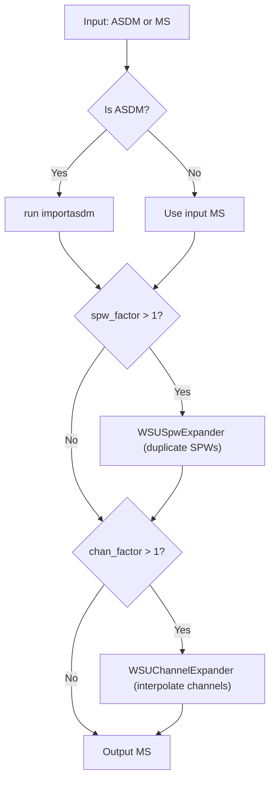

# Design

`wsusd` modifies CASA MeasurementSets in place using `casatasks.private.sdutil` table managers.

---

## 1. Channel Expansion (`WSUChannelExpander`)

Given a channel expansion factor `chan_factor > 1`:

### `SPECTRAL_WINDOW`
* `NUM_CHAN`: scaled by `chan_factor` (`round(NUM_CHAN * chan_factor)`).
* `CHAN_WIDTH`: scaled by `1 / chan_factor`.
* `CHAN_FREQ`: regenerated as an arithmetic progression over the original band using the new channel width.
* `EFFECTIVE_BW`: scaled by `1 / chan_factor`.
* `RESOLUTION`: scaled by `1 / chan_factor`.

### `SYSCAL`
Temperature spectra columns (`TCAL_SPECTRUM`, `TRX_SPECTRUM`, `TSKY_SPECTRUM`, `TSYS_SPECTRUM`, `TANT_SPECTRUM`, `TANT_TSYS_SPECTRUM`) are interpolated from the input frequency grid to the output grid using linear interpolation.

### `MAIN`
* **Visibilities (`FLOAT_DATA` / `DATA`)**:
  1. Flattened across polarizations and rows for vectorized evaluation: `(npol * nrow, nchan_in)`.
  2. Smoothed using a Gaussian kernel (`sigma = 2`, odd tap count `N ≈ 10 * sigma + 1`) via `scipy.ndimage.convolve1d`.
  3. Interpolated across channel frequency onto the expanded grid using `scipy.interpolate.interp1d(axis=1)`.
  4. Residual noise (`data_flat - smoothed_flat`) is measured row-by-row via sigma-clipped standard deviation (`robust_stddev`). Synthetic Gaussian noise with this standard deviation is added to the interpolated spectra.
* **Flags (`FLAG`)**: interpolated to the new frequency grid using nearest-neighbor lookup (`scipy.interpolate.interp1d(kind='nearest')`).
* **Weights (`WEIGHT_SPECTRUM`)**: scaled by `1 / chan_factor` (proportional to channel width).
* **Sigma (`SIGMA_SPECTRUM`)**: scaled by `sqrt(chan_factor)` (inversely proportional to square root of channel width).

### Chunking and Table Swapping
To handle large datasets without loading the entire MS into memory:
1. `copy_table_structure()` creates a temporary empty copy of the MS table.
2. Visibility data rows are read, interpolated, and written in blocks (100 rows per chunk).
3. On completion, the temporary table directory replaces the original table directory on disk.

---

## 2. Spectral Window Duplication (`WSUSpwExpander`)

Given an SPW factor `spw_factor > 1`, science and atmospheric spectral windows are duplicated `spw_factor - 1` times to emulate wideband multi-tuning setups.

### Sub-table Updates
* **`SPECTRAL_WINDOW`**: Target SPW rows are duplicated with `tb.copyrows()`. SPW names append a two-digit cycle identifier (e.g. `ALMA_RB_06#00#...`).
* **`DATA_DESCRIPTION`**: Appends new rows referencing the new `SPECTRAL_WINDOW_ID` values while retaining polarization mappings.
* **`SYSCAL`, `FEED`, `SOURCE`**: Duplicates corresponding rows with updated `SPECTRAL_WINDOW_ID` references.
* **`MAIN`**: Rows matching the target SPWs are duplicated using `copy_selected_main_rows()`, updating `DATA_DESC_ID` to point to the newly added data descriptions.
